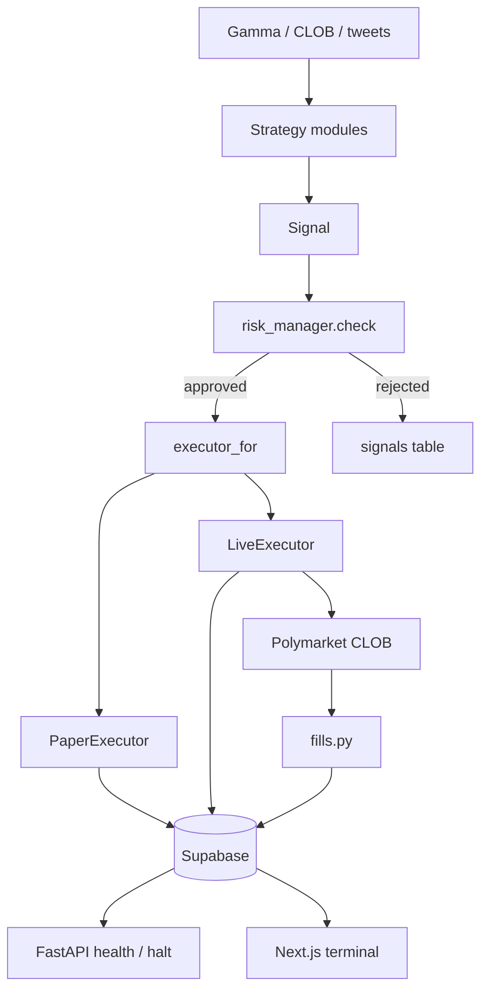

# Architecture

## Purpose

Show how the **running application** is wired: FastAPI process, engine cycle, strategy modules, risk, execution, Supabase, and the Next.js terminal.

## High-level architecture

```text
Polymarket (Gamma / CLOB / user WS)     Social counts (xTracker / tweets)
                 \                         /
                  → Strategy modules (api/modules/*)
                              ↓
                       Signal (risk_manager.Signal)
                              ↓
                      risk_manager.check()
                              ↓
              executor_for(module.status)
                 /                    \
        PaperExecutor              LiveExecutor
        (rest + book-cross)        (post-only CLOB)
                 \                    /
                  → orders / trades / positions
                              ↓
                         Supabase
                    /              \
         FastAPI /api/*        Next.js /app/api/*
                              ↓
                      Maker terminal UI
```



## Major components

| Component | Location | Role |
|---|---|---|
| FastAPI app | `api/main.py` | Lifespan: discover modules, start `Engine` + tweet collector |
| Module registry | `api/modules/__init__.py` | Drop-in folders exporting `Module` |
| Engine | `api/services/engine.py` | Interval cycle: paper fills, exits, evaluate → risk → execute |
| Risk | `api/services/risk_manager.py` | Fail-closed `check()` |
| Executors | `api/services/executor.py` | Paper rest vs live post-only |
| Fills | `api/services/fills.py` | User WS + REST reconcile for **live** orders |
| Positions | `api/services/position_manager.py` | Apply buy/sell fills |
| Dashboard | `web/app/page.tsx` | Polls `web/app/api/terminal` (Supabase) |
| Health | `api/routers/health.py` | `/api/healthz`, `/api/engine/health`, halt |

## Data flow

1. Scheduler (`DEFAULT_INTERVAL`, default 300s) calls `Engine.cycle`.
2. Paper resting orders may fill against live top-of-book (`PaperExecutor.check_fills`).
3. Each non-`inactive` Supabase `modules` row maps to a `BaseModule` via `for_db_row`.
4. `module.evaluate(module_id)` returns `Signal` list (exits sorted first).
5. `risk_manager.check` records approve/reject on `signals`.
6. Approved signals go to `executor_for(status)`.

## Backend vs dashboard

- Backend **writes** trading state and exposes health/halt.
- Dashboard is largely **read-only**: Next.js server routes query Supabase (`web/app/api/terminal/route.ts`, `web/app/api/snapshots/route.ts`).
- Dashboard is password-gated (`web/middleware.ts`, `DASHBOARD_PASSWORD`).

## Research vs production

| Production path | Research / historical |
|---|---|
| `api/`, `web/`, `tests/` | `research/`, many `scripts/` |
| `Engine` cycle | `backtest/engine.py` — orphaned, not imported by `api/` |
| Canonical loaders in `api/modules/shared/canonical_data.py` | One-off pacing/sweep scripts |

Research code may contain experiment-specific assumptions and should be reviewed independently before reuse.

## Deployment context

- Local: uvicorn `:8010`, Next `:3010` (`scripts/windows/start.bat`).
- Railway: `railway.toml` runs `uvicorn api.main:app` on `$PORT`, health `/api/healthz`.
- `docker-compose.yml` maps **8000/3000** and is labeled “use when ready” — not the primary Windows path.
- `infra/` has VPS, watchdog, and Cloudflare proxy helpers.
